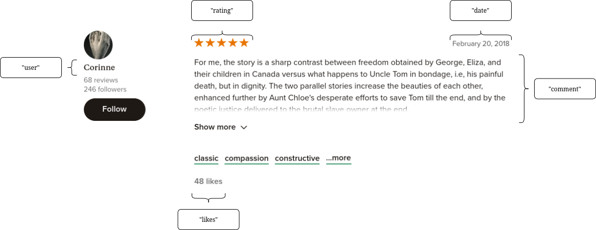

# Data Post Web Scrapping 

The above elements are scrapped from the community review pages for the book on Goodreads. These are saved in a JSON.

| user | rating | comment | date | likes | 
| -------- | ------- | ------- | ------- | ------- |
| Beverly | 4 | "Entertainment Weekly has an interview they do in which they ask famous authors ... | December 17, 2017 | 64 likes | 

# Data Post Preprocessing 

| review_id | user | rating | comment | tokenized_comment | review_char_count | review_word_count | date | numLikes | lemmatized_comment | 
| -------- | ------- | ------- | ------- | ------- | -------- | ------- | ------- | ------- | ------- |
| 0 | Beverly | 4.0 | "Entertainment Weekly has an interview they do in which they ask famous authors ... | ["entertainment","weekly","interview","ask","famous","authors" ...] | 1242 | 236 | 1513468800000 | 64 | ["entertainment","NN"],["weekly","RB"],["interview","NN"],["ask","VBP"],["famous","JJ"] ... | 

# Dataset Post Sentiment Modeling 

| review_id | user | rating | comment | tokenized_comment | review_char_count | review_word_count | date | numLikes | lemmatized_comment | lemmatized_string | VADER_compound | VADER_label | roberta_compound | roberta_label | 
| -------- | ------- | ------- | ------- | ------- | -------- | ------- | ------- | ------- | ------- | -------- | ------- | ------- | ------- | ------- |
| 0 | Beverly | 4.0 | "Entertainment Weekly has an interview they do in which they ask famous authors ... | ["entertainment","weekly","interview","ask","famous","authors" ...] | 1242 | 236 | 1513468800000 | 64 | ["entertainment","NN"],["weekly","RB"],["interview","NN"],["ask","VBP"],["famous","JJ"] ... | entertainment weekly interview ask famous ... | -0.6999 | negative | -0.5590503216 | negative | 

# Dataset Post Topic Modeling 

| review_id | user | rating | comment | tokenized_comment | review_char_count | review_word_count | date | numLikes | lemmatized_comment | lemmatized_string | VADER_compound | VADER_label | roberta_compound | roberta_label | lda_topic | lda_prob | bert_topic | bert_prob | 
| -------- | ------- | ------- | ------- | ------- | -------- | ------- | ------- | ------- | ------- | -------- | ------- | ------- | ------- | ------- | ------- | ------- | ------- | ------- |
| 0 | Beverly | 4.0 | "Entertainment Weekly has an interview they do in which they ask famous authors ... | ["entertainment","weekly","interview","ask","famous","authors" ...] | 1242 | 236 | 1513468800000 | 64 | ["entertainment","NN"],["weekly","RB"],["interview","NN"],["ask","VBP"],["famous","JJ"] ... | entertainment weekly interview ask famous ... | -0.6999 | negative | -0.5590503216 | negative | 0 | 0.4091017052 | 0 | 1.0 |